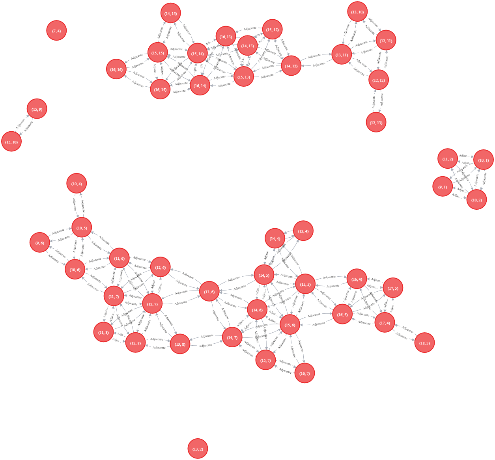
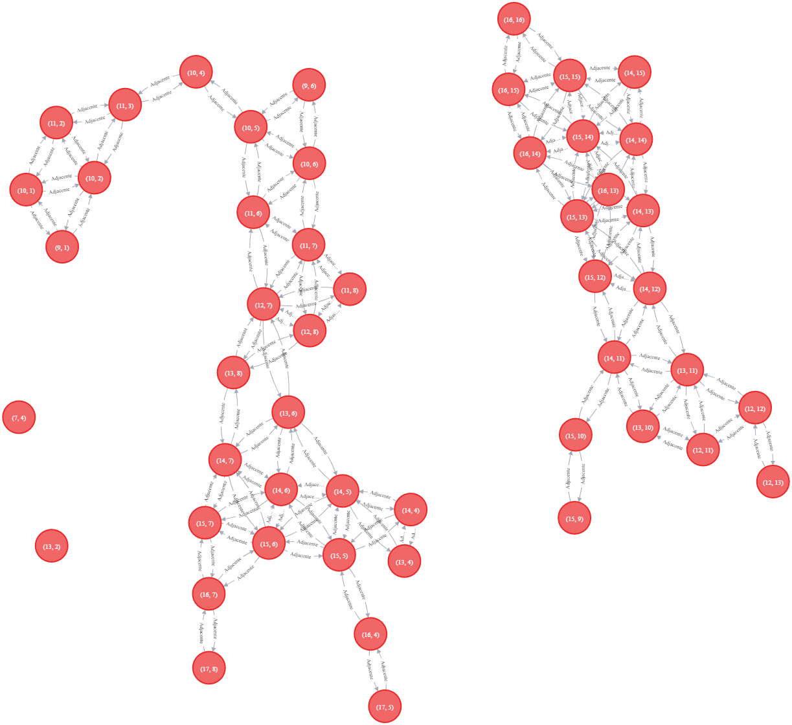
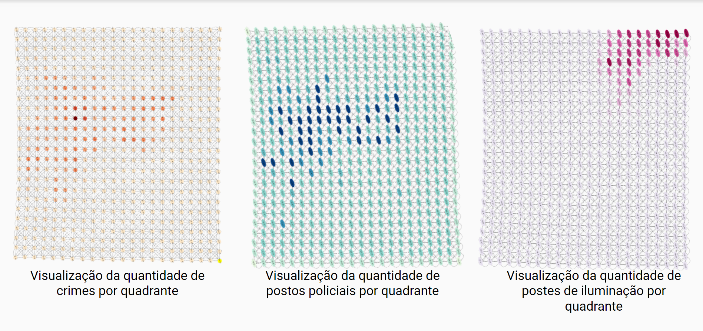
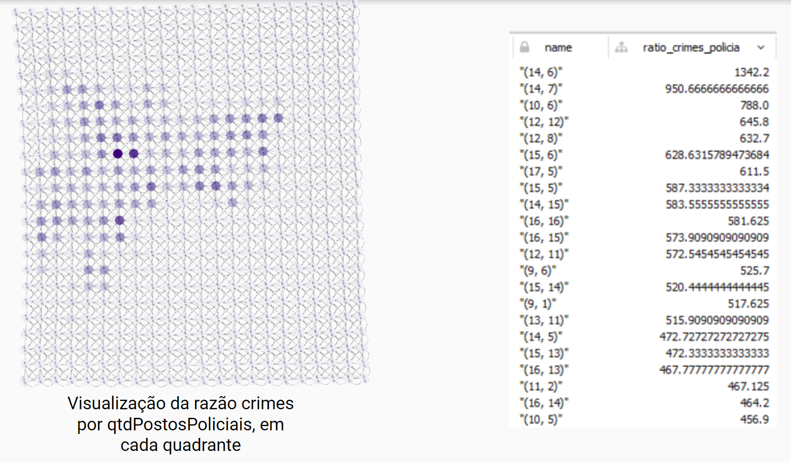
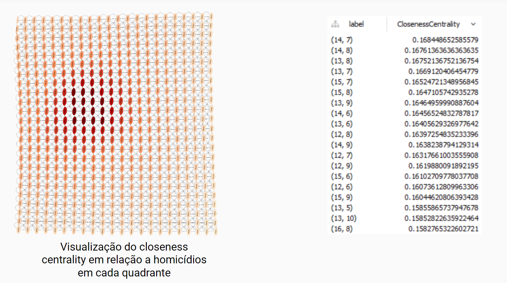
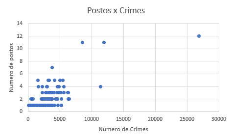
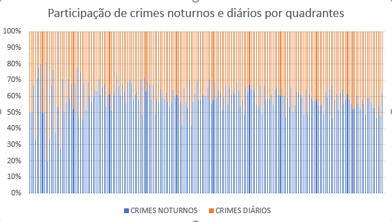
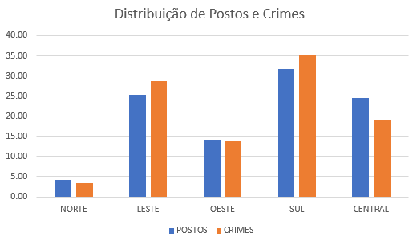
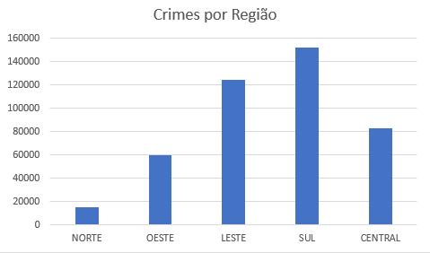
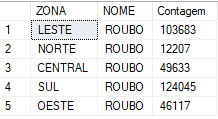

# Projeto "Mapeamento da Criminalidade em SP"

# Equipe `Os Delegados` - `SSPD`
* Antonio Gabriel da Silva Fernandes - 231551
* Bruno Henrique Emidio Leite - 214017
* Lucas de Paula Soares - 201867

# Estrutura de Arquivos e Pastas

~~~
├── README.md  <- arquivo apresentando a proposta
│
├── data
│   ├── external       <- dados de terceiros em formato usado para entrada na transformação
│   ├── interim        <- dados intermediários, e.g., resultado de transformação
│   ├── processed      <- dados finais usados para a publicação
│   └── raw            <- dados originais sem modificações
│
├── notebooks          <- Jupyter notebooks ou equivalentes
│
├── slides             <- arquivo de slides em formato PDF
│
├── src                <- fonte em linguagem de programação  (e.g., Python)
│   └── README.md      <- instruções básicas de instalação/execução
│
└── assets             <- mídias usadas no projeto
~~~

## Resumo do Projeto
O projeto visa agregar dados da Secretaria de Segurança Pública de São Paulo e da Prefeitura de São Paulo referentes a crimes ocorridos na cidade, iluminação pública e posição de postos policiais, com o objetivo de tornar possível a análise da correlação entre a ocorrência de crimes e a infraestrutura da cidade.

## Slides da Apresentação
Link para apresentação final: [apresentação](slides/final_apresentacao.pdf)

## Modelo Conceitual

## Modelos Lógicos
### Modelo lógico relacional:
~~~
Crimes(_ID_, DATA_OCORRENCIA, PERIODO_OCORRENCIA, HORA_OCORRENCIA, ANO_BO, LAT, LON, TIPO_CRIME, QUAD)
  TIPO_CRIME chave estrangeira -> Tipos_crimes(NOME)
  QUAD chave estrangeira -> Quads(ID)

Tipos_Crimes(_NOME_)

Quads(_ID_, LON_MIN, LON_MAX, LAT_MIN, LAT_MAX)

Postes_ilum(_ID_, LAT, LON, QUAD)
  QUAD chave estrangeira -> Quads(ID)

Postos(_ID_, CLASSE, TIPO, LAT, LON, QUAD)
  QUAD chave estrangeira -> Quads(ID)
~~~

### Modelo lógico de grafo de propriedades:

## Dataset Publicado
título do arquivo/base | link | breve descrição
----- | ----- | -----
`crimes.csv` | [Link](data/processed/crimes.csv) | Tabela com os dados de crimes (tabela `Crimes` do modelo relacional).
`grafo.csv` | [Link](data/processed/grafo.csv) | Tabela com os vértices e arestas que podem ser utilizados para importar o modelo de grafos no Neo4j.
`postes_ilum.csv` | [Link](data/processed/postes_ilum.csv) | Tabela com os dados dos postes de iluminação (tabela `Postes_ilum` do modelo relacional).
`postos.csv` | [Link](data/processed/postos.csv) | Tabela com os dados de postos policiais (tabela `Postos` do modelo relacional).
`quads.csv` | [Link](data/processed/quads.csv) | Tabela descrevendo os quadrantes usados na análise (tabela `Quads` do modelo relacional).
`tipos_crimes.csv` | [Link](data/processed/tipos_crimes.csv) | Tabela listando os diferentes tipos de crimes retratados na tabela `crimes.csv` (tabela `Tipos_Crimes` do modelo relacional).

## Bases de Dados
título da base | link | breve descrição
----- | ----- | -----
Dados de crimes da SSP-SP | [Link](http://www.ssp.sp.gov.br/transparenciassp/Consulta.aspx) | Dados de BO's Registrados no Estado de São Paulo de 2010 até 2021
Iluminação pública em São Paulo | [Link](http://dados.prefeitura.sp.gov.br/dataset/iluminacao-publica) | Pontos de iluminação pública da cidade de São Paulo. Cada um dos pontos representa um poste com uma ou mais luminárias.
Equipamentos de segurança urbana | [Link](http://dados.prefeitura.sp.gov.br/dataset/equipamentos-de-seguranca-urbana) | Endereços e outros dados das unidades da Guarda Civil Metropolitana e da SSP-SP.
Google Maps Geocoding API | [Link](https://developers.google.com/maps/documentation/geocoding/overview) | API da Google que, dado um endereço, fornece as coordenadas daquele endereço.

## Detalhamento do Projeto
### Dados de crimes
Os dados foram baixados de forma automatizada usando [Selenium](https://selenium-python.readthedocs.io/) com um [script](src/auto_download_crimes.py) Python. O uso dessa ferramenta foi necessário porque o site disponibiliza os dados através de uma aplicação Javascript, de tal forma que é difícil interagir com a aplicação usando requisições HTTP apenas. Além disso, para cada tipo de crime, as tabelas são disponibilizadas de forma mensal, o que resultaria em uma grande demora para a coleta dos dados manual. Foram adquiridas mais de 500 tabelas individuais.

Com os dados baixados, foi possível juntá-los todos em um único arquivo CSV. Várias colunas com dados que não seriam úteis para nós foram descartadas. Foram descartadas também as linhas com dados incompletos, as linhas correspondentes a BOs complementares e as correspondentes a BOs fora da cidade de São Paulo. Além disso, foi criada uma coluna de ID.

Os dados originais têm, associado a cada BO, o crime ou a ocorrência registrada. Devido à grande variedade de valores nesse campo, decidimos que seria melhor criar algumas grandes categorias de crime, de forma a facilitar análises. Os crimes dentro de cada categoria podem ser vistos nos arquivos da pasta `data/interim/tipos crimes`. Essa classificação foi feita parcialmente de forma manual, mas majoritariamente usando scripts que buscavam certas palavras-chave nos registros. Depois, foi criada uma coluna na tabela para armazenar o tipo do crime usando um [script](src/separar_tipos.py). Os diferentes tipos foram listados também em uma [tabela separada](data/processed/tipos_crimes.csv).

Depois que os limites dos quadrantes haviam sido determinados, um script simples foi usado para determinar em que quadrante cada crime estava localizado, chegando assim à [tabela final](data/processed/crimes.csv).

### Dados de iluminação pública
A partir dos dados originais, foram necessárias poucas transformações. A coluna "LOCAL" presente na tabela original foi descartada, assim com algumas linhas com dados sem sentido (latitudes e longitudes grandes demais, por exemplo). A coluna "ID" na tabela original foi substituída por números sequenciais.

Após estarem definidos os limites dos quadrantes, um [script](src/quadrantes_postes_novo.py) foi usado para determinar os quadrantes de cada poste e adicioná-los à [tabela final](data/processed/postes_ilum.csv).

### Dados de postos policiais
Foram baixados os dados de equipamentos de segurança pública da cidade de São Paulo, e deles foram selecionados apenas os dados pertinentes a unidades da Guarda Civil Metropolitana, Polícia Civil e Polícia Militar. Foram descartadas a maioria das colunas, exceto a classe, nome, endereço e bairro. Foram descartadas também as linhas com dados incompletos, e os nomes dos bairros foram normalizados manualmente para que fossem consistentes entre si. Depois, todos os dados restantes foram juntados em uma única [tabela](), onde foram atribuídos IDs únicos para cada linha. 

Com isso, foi criado um [script](src/geocoder_postos.py) para acessar a API de Geocoding do Google Maps e determinar a latitude e longitude de cada um dos postos policiais, e esses dados foram armazenados na [tabela](data/interim/postos_policiais_geocoded.csv). Após essa etapa, os dados de endereço e bairros foram descartados. 

Por fim, depois que os limites dos quadrantes haviam sido determinados, foi utilizado um [script](src/quadrantes_postos_novo.py) para determinar em qual quadrante cada um dos postos estava localizado, e esse dado foi também armazenado na [tabela final](data/processed/postos.csv).

### Quadrantes
A determinação dos quadrantes foi feita com um [script](src/ajustar_quads.py). Primeiramente, foram determinadas a latitude e longitude mínima e máxima presentes nas tabelas de crimes e de postos policiais. Os postes de iluminação não foram levados em consideração nesse momento, pois os postes que não estivessem próximos a um posto policial ou a um crime não seriam relevantes para essa análise, e seriam descartados posteriormente.

~~~python
latmin = min(postos_df.LAT.min(), crimes_df.LAT.min())
latmax = max(postos_df.LAT.max(), crimes_df.LAT.max())
lonmin = min(postos_df.LON.min(), crimes_df.LON.min())
lonmax = max(postos_df.LON.max(), crimes_df.LON.max())
~~~

Com esses limites, e supondo quadrantes com 3 km de lado, o que é equivalente a aproximadamente 0.027027 graus de latitude ou longitude, foram definidos os limites inferior e superior de cada quadrante:

~~~python
TAM_QUAD = 0.027027

n_quads_lat = int(np.ceil((latmax - latmin)/TAM_QUAD))
n_quads_lon = int(np.ceil((lonmax - lonmin)/TAM_QUAD))
n_quads = n_quads_lon * n_quads_lat

lats = [latmin + i*TAM_QUAD for i in range(n_quads_lat + 1)]
lons = [lonmin + i*TAM_QUAD for i in range(n_quads_lon + 1)]
~~~

Com isso, foi criada a [tabela](data/processed/quads.csv) com os limites de cada quadrante e seus respectivos nomes. São, ao total, 528 quadrantes, sendo 24 no sentido da latitude e 22 no sentido da longitude.

### Modelo de grafos
O modelo de grafos foi construído no Neo4j usando [comandos cypher](src/contrucao_dataset.cypher) para importar os dados das tabelas previamente construídas de acordo com o modelo que já foi apresentado previamente. Foi necessário instalar o Neo4j localmente, pois a implementação em nuvem não tinha capacidade para lidar com a grande quantidade de dados do nosso projeto.

## Evolução do Projeto
### Modelo Conceitual
Os modelos propostos para o projeto mudaram consideravelmente ao longo do desenvolvimento. A primeira versão do modelo conceitual, por exemplo, pode ser vista a seguir:

Encontramos diversos problemas com esse modelo. Primeiramente, ter locais armazenados na forma de endereços faz com que seja muito mais complexo analisar a distância entre eles, já que seria necessário usar algum tipo de serviço de terceiros para determinar a distância ao longo das vias. Além disso, a existência das relações "Mais próximo" faria com que, sempre que uma nova linha fosse adicionada ao banco de dados, seria necessário recalcular a proximidade entre todos os outros elementos do banco. Por isso, concluímos que a análise de proximidade faria mais sentido como uma análise a ser feita após a criação do banco do que como um dado diretamente disponibilizado.

Na tentativa de resolver esses problemas, migramos para o modelo final, já apresentado anteriormente:

Nesse modelo, as localizações dos elementos são guardadas em forma de coordenadas, de forma que é mais simples calcular a distância (euclidiana) entre dois pontos. Além disso, foi introduzido o conceito dos quadrantes, com limites bem estabelecidos de latitude e longitude, de forma que cada poste, posto policial ou crime está localizado em um quadrante. Esse conceito facilita bastante análises em um contexto mais macro, quando não são necessárias as coordenadas exatas dos elementos. Também foi criada uma entidade "Tipo Crime". 

O modelo lógico relacional também evoluiu de forma a acompanhar as mudanças no modelo lógico, de acordo com as técnicas aprendidas em sala de mapeamento entre os modelos.

### Quadrantes
Inicialmente, a divisão em quadrantes foi feita utilizando quadrantes de 10 km de lado. No entanto, foram encontrados problemas com essa primeira abordagem. Primeiro, os quadrantes estavam grandes demais e, por isso, as análises não estavam rendendo resultados muito conclusivos. Além disso, devido à existência de alguns outliers entre os crimes, ou seja, crimes que ocorreram muito distantes da área principal da cidade, os limites de latitude e longitude utilizados para definir a região abrangida pelos dados. O resultado da junção desses dois fatores é que tínhamos 1064 quadrantes, dos quais apenas 31 tinham algum crime. Depois que esses outliers foram removidos e os quadrantes diminuídos para 3 km, passamos a ter 528 quadrantes, dos quais 200 têm pelo menos um crime.

## Perguntas de Pesquisa/Análise Combinadas e Respectivas Análises

### Perguntas/Análise com Resposta Implementada - Modelo de Grafos

#### Pergunta/Análise 1
* Quais são os quadrantes com maior quantidade de crimes?
  * É possível, para cada quadrante, contar quantos nós de crime têm arestas ligando a ele. Esse valor é associado a uma propriedade no nó do quadrante, e depois são retornados os 50 nós com maior quantidade de crimes. Essa análise é interessante nesse modelo pois é possível observar grandes regiões conexas formadas por vários quadrantes com alta criminalidade, implicando a existência de macrorregiões particularmente perigosas compostas por vários quadrantes.

~~~cypher
MATCH (q:Quad)
WITH q
ORDER BY q.qtdCrimes DESC
LIMIT 50
RETURN q
~~~

#### Pergunta/Análise 2
* Quais são os quadrantes com maior quantidade de crimes noturnos?
  * Semelhante à pergunta anterior, para cada quadrante, vamos contar quantos nós de crime têm arestas ligando a ele, mas dessa vez considerando apenas crimes noturnos. Esse valor é associado a uma propriedade no nó do quadrante, e depois são retornados os 50 nós com maior quantidade de crimes. Assim como na pergunta anterior, essa análise é interessante nesse modelo pois é possível observar grandes regiões conexas formadas por vários quadrantes com alta criminalidade, implicando a existência de macrorregiões particularmente perigosas compostas por vários quadrantes.

~~~cypher
MATCH (q:Quad)
SET q.qtdCrimesNoite = 0

MATCH (c:Crime {periodoOcorrencia: "A NOITE"})-[:Localizado]->(q:Quad)
SET q.qtdCrimesNoite = q.qtdCrimesNoite + 1

MATCH (q:Quad)
WITH q
ORDER BY q.qtdCrimesNoite DESC
LIMIT 50
RETURN q
~~~

#### Pergunta/Análise 3
* Como estão distribuídos os crimes, os postos policiais e os postes de iluminação pelos quadrantes?
  * Podemos simplesmente contar quantos crimes, postos policiais ou postes de iluminação estão ligados a cada quadrante e criar uma visualização no Cytoscape para ver os resultados. Essa análise é útil para tornar mais palpável a distribuição dos dados.

Como podemos ver, os crimes e os postes policiais seguem uma distribuição que se aproxima do formato da cidade de São Paulo. No entanto, os postes de iluminação estão claramente deslocados e fora da cidade. Com isso, depois de investigações mais profundas usando os dados originais, constatamos que os dados de iluminação fornecidos pela prefeitura são de má qualidade. Dessa forma, as nossas análises que envolvem os dados de iluminação podem render resultados incoerentes, mas ainda assim a ideia por trás delas é teoricamente correta.

#### Pergunta/Análise 4
* Quais são os quadrantes com maior razão entre crimes e quantidade de postos policiais?
  * Foi feita uma visualização usando o Cytoscape para observar essa métrica. Um valor alto para essa razão pode indicar a necessidade da construção de mais postos policiais naquela área.

É possível notar uma região central com altos valores para essa métrica, principalmente nos quadrantes (14, 6) e (14, 7). Isso pode significar que alguma intervenção é necessária nessa área.

#### Pergunta/Análise 5
* Quais são os pontos com maior closeness centrality em relação a homicídios?
  * A closeness centrality é uma boa métrica para analisar quadrantes mais perigosos por levar em consideração também os homicídios ocorridos nos quadrantes vizinhos. Assim, é possível, a partir dessa métrica, estipular a região com maior probabilidade de homicídio.

É possível observar que os maiores valores dessa métrica também estão próximos do quadrante (14, 7), indicando um hotspot de crimes nessa área.

### Perguntas/Análise com Resposta Implementada - Modelo Relacional

#### Pergunta/Análise 1
* Qual a relação entre o número de postes policiais e número de crimes nos quadrantes?
  * É possível comparar, dentro de um mesmo quadrante, o número de crimes e o número de postes para verificar qual o efeito dos postos policiais nos crimes, verificando se ocorre um aumento ou diminuição dos crimes de acordo com o número de postos. A partir da tabela, é possível construir um gráfico de dispersão para facilitar a visualização,
~~~sql
CREATE VIEW Numero_postos AS

SELECT Q.ID, COUNT(*) N_POSTOS
   FROM Postos P, Quads Q
   WHERE P.QUAD= Q.ID
   GROUP BY Q.ID;
SELECT NC.ID, NC.N_CRIMES, NP.N_POSTOS
   FROM Numero_crimes NC, Numero_postos NP
   WHERE NC.ID = NP.ID
   ORDER BY NC.N_CRIMES
~~~

É possível observar que as regiões com maior número de crimes possuem maior número de postos, fazendo com que São Paulo possua uma boa distribuição de postos para tentar os crimes

#### Pergunta/Análise 2
* Em que período do dia ocorrem mais crimes em um determinado quadrante? Quais quadrantes são mais perigosos de noite?
  * Através dos horários que os crimes foram cometidos é possível separar os crimes que ocorrem durante o dia e durante a noite, possibilitando também a comparação entre o número de crimes entre os diferentes períodos do dia.
~~~sql
CREATE VIEW Numero_crimes_noturnos AS
SELECT Q.ID, COUNT(*) N_CRIMES_NOTURNOS
FROM Crimes C, Quads Q
WHERE C.QUAD = Q.ID AND (C.PERIODO_OCORRENCIA = 'A NOITE' OR C.PERIODO_OCORRENCIA = 'DE MADRUGADA')
GROUP BY Q.ID;

CREATE VIEW Numero_crimes_diarios AS
SELECT Q.ID, COUNT(*) N_CRIMES_DIARIOS
FROM Crimes C, Quads Q
WHERE C.QUAD = Q.ID AND (C.PERIODO_OCORRENCIA = 'PELA MANHÃ' OR C.PERIODO_OCORRENCIA = 'A TARDE')
GROUP BY Q.ID;

CREATE VIEW Numero_crimes AS
SELECT Q.ID, COUNT(*) N_CRIMES
FROM Crimes C, Quads Q
WHERE Q.ID = C.QUAD
GROUP BY Q.ID;

SELECT NCN.ID, CAST(NCD.N_CRIMES_DIARIOS AS FLOAT)/NC.N_CRIMES*100 Per_diario, CAST(NCN.N_CRIMES_NOTURNOS AS FLOAT)/NC.N_CRIMES*100 Per_noturno
FROM Numero_crimes_noturnos NCN, Numero_crimes_diarios NCD, Numero_crimes NC
WHERE NCN.ID = NCD.ID AND NCN.ID = NC.ID
~~~

  
Para a grande maioria dos casos, há mais crimes no período noturno do que no período diário.

#### Pergunta/Análise 3
* Como é a distribuição dos postos de policiais dentro de São Paulo comparado com a distribuição de crimes?
  * A partir dos quadrantes obtidos, é possível separá-los de acordo com as regiões oficiais 'Norte', 'Sul', 'Leste', 'Oeste' e 'Centro' de São Paulo. Dessa forma, é possível comparar se os postos estão devidamente distribuídos dentro dessas regiões da mesma forma que os crimes estão distribuídos, ou seja, se há uma boa alocação de recursos de segurança em São Paulo.
~~~sql
CREATE VIEW CRIMES_REG AS
SELECT Q.ZONA, COUNT(*) Contagem
FROM QUADS Q, CRIMES C
WHERE Q.ID = C.QUAD
GROUP BY Q.ZONA
  
CREATE VIEW POSTES_REG AS
SELECT Q.Zona, SUM(NP.N_POSTES) N_POSTES
FROM QUADS Q, Numero_postes NP
WHERE Q.ID = NP.ID
GROUP BY Q.ZONA

SELECT PR.Zona, (CAST(PR.N_POSTOS AS FLOAT)/(SELECT CAST(COUNT(*) AS FLOAT) FROM POSTOS))*100 Postos, 
(CAST(CR.Contagem AS FLOAT)/(SELECT CAST(COUNT(*) AS FLOAT) FROM CRIMES))*100 Crimes
FROM POSTOS_REG PR, CRIMES_REG CR
WHERE PR.ZONA = CR.ZONA
~~~

No geral, crimes e postos estão distribuídos de maneira equivalente.

#### Pergunta/Análise 4
* Como os crimes se distribuem nas regiões de São Paulo?
  * A partir das regiões criadas com os quadrantes, é possível contar os números de crimes e analisar como é a contribuição das regiões para o númeor total de crimes.
~~~sql
SELECT Zona, (CAST(Contagem AS FLOAT)/(SELECT CAST(COUNT(*) AS FLOAT) FROM CRIMES))*100 Porcentagem
FROM CRIMES_REG
~~~

  
As regiões Sul e Leste são as com maiores números de crimes.

#### Pergunta/Análise 5
* Quais são os tipos de crimes mais comuns em São Paulo? E por região?
  * Com a classificação dos tipos de crimes, é possível contabilizar qual o tipo de crime que mais ocorre na cidade e em suas regiões.
~~~sql
CREATE VIEW Tipo_Regiao AS
SELECT Q.ZONA, TC.NOME, COUNT(*) Contagem
FROM QUADS Q, CRIMES C, TIPOS_CRIMES TC
WHERE Q.ID = C.QUAD AND TC.NOME = C.TIPO_CRIME
GROUP BY Q.ZONA, TC.NOME

SELECT ZONA, NOME, Contagem
FROM Tipo_Regiao
WHERE Contagem = (SELECT MAX(CONTAGEM) FROM Tipo_Regiao WHERE ZONA = 'NORTE')
OR	Contagem = (SELECT MAX(CONTAGEM) FROM Tipo_Regiao WHERE ZONA = 'SUL')
OR	Contagem = (SELECT MAX(CONTAGEM) FROM Tipo_Regiao WHERE ZONA = 'LESTE')
OR	Contagem = (SELECT MAX(CONTAGEM) FROM Tipo_Regiao WHERE ZONA = 'OESTE')
OR	Contagem = (SELECT MAX(CONTAGEM) FROM Tipo_Regiao WHERE ZONA = 'CENTRAL');
~~~

Em toda São Paulo, o tipo de crime mais comum é roubo.

#### Outras Perguntas/Análises
Assim como a distribuição de postos, é possível realizar as mesmas questões para os postes. Além disso, é possível agrupar o número de postes e postos policiais para verificar como o maior número de equipamentos de segurança em um mesmo quadrante/região afeta os crimes ocorridos neles.
