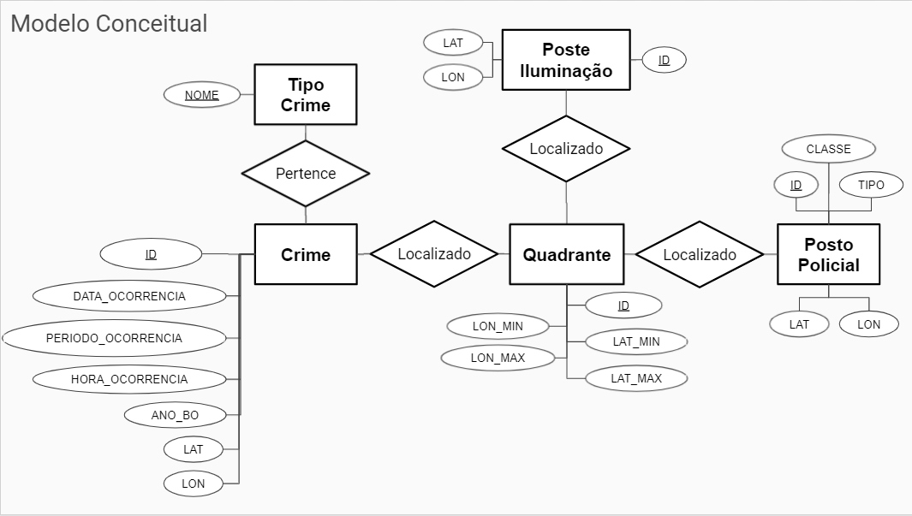
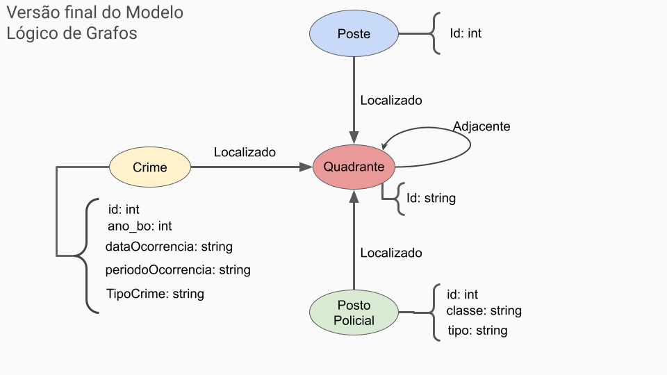
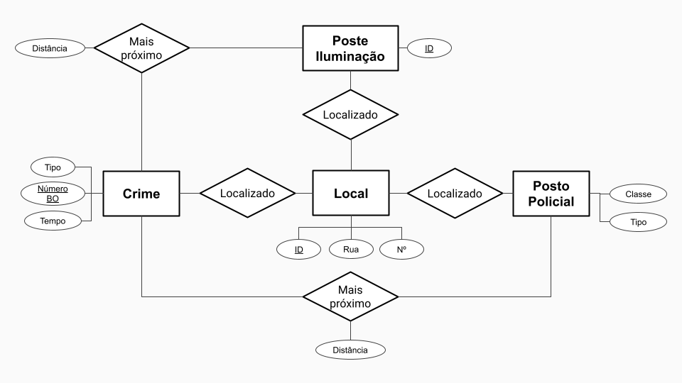

# Projeto "Mapeamento da Criminalidade em SP"

# Equipe `Os Delegados` - `SSPD`
* Antonio Gabriel da Silva Fernandes - 231551
* Bruno Henrique Emidio Leite - 214017
* Lucas de Paula Soares - 201867

# Estrutura de Arquivos e Pastas

~~~
├── README.md  <- arquivo apresentando a proposta
│
├── data
│   ├── external       <- dados de terceiros em formato usado para entrada na transformação
│   ├── interim        <- dados intermediários, e.g., resultado de transformação
│   ├── processed      <- dados finais usados para a publicação
│   └── raw            <- dados originais sem modificações
│
├── notebooks          <- Jupyter notebooks ou equivalentes
│
├── slides             <- arquivo de slides em formato PDF
│
├── src                <- fonte em linguagem de programação  (e.g., Python)
│   └── README.md      <- instruções básicas de instalação/execução
│
└── assets             <- mídias usadas no projeto
~~~

## Resumo do Projeto
O projeto visa agregar dados da Secretaria de Segurança Pública de São Paulo e da Prefeitura de São Paulo referentes a crimes ocorridos na cidade, iluminação pública e posição de postos policiais, com o objetivo de tornar possível a análise da correlação entre a ocorrência de crimes e a infraestrutura da cidade.

## Slides da Apresentação
Link para apresentação final: [apresentação](slides/final_apresentacao.pdf)

## Modelo Conceitual

## Modelos Lógicos
### Modelo lógico relacional:
~~~
Crimes(_ID_, DATA_OCORRENCIA, PERIODO_OCORRENCIA, HORA_OCORRENCIA, ANO_BO, LAT, LON, TIPO_CRIME, QUAD)
  TIPO_CRIME chave estrangeira -> Tipos_crimes(NOME)
  QUAD chave estrangeira -> Quads(ID)

Tipos_Crimes(_NOME_)

Quads(_ID_, LON_MIN, LON_MAX, LAT_MIN, LAT_MAX)

Postes_ilum(_ID_, LAT, LON, QUAD)
  QUAD chave estrangeira -> Quads(ID)

Postos(_ID_, CLASSE, TIPO, LAT, LON, QUAD)
  QUAD chave estrangeira -> Quads(ID)
~~~

### Modelo lógico de grafo de propriedades:

## Dataset Publicado
### Arquivos finais (em `data/processed/`)
título do arquivo/base | link | breve descrição
----- | ----- | -----
`crimes.csv` | [Link](data/processed/crimes.csv) | Tabela com os dados de crimes (tabela `Crimes` do modelo relacional).
`postes_ilum.csv` | [Link](data/processed/postes_ilum.csv) | Tabela com os dados dos postes de iluminação (tabela `Postes_ilum` do modelo relacional).
`postos.csv` | [Link](data/processed/postos.csv) | Tabela com os dados de postos policiais (tabela `Postos` do modelo relacional).
`quads.csv` | [Link](data/processed/quads.csv) | Tabela descrevendo os quadrantes usados na análise (tabela `Quads` do modelo relacional).
`tipos_crimes.csv` | [Link](data/processed/tipos_crimes.csv) | Tabela listando os diferentes tipos de crimes retratados na tabela `crimes.csv` (tabela `Tipos_Crimes` do modelo relacional).

## Bases de Dados
título da base | link | breve descrição
----- | ----- | -----
Dados de crimes da SSP-SP | [Link](http://www.ssp.sp.gov.br/transparenciassp/Consulta.aspx) | Dados de BO's Registrados no Estado de São Paulo de 2010 até 2021
Iluminação pública em São Paulo | [Link](http://dados.prefeitura.sp.gov.br/dataset/iluminacao-publica) | Pontos de iluminação pública da cidade de São Paulo. Cada um dos pontos representa um poste com uma ou mais luminárias.
Equipamentos de segurança urbana | [Link](http://dados.prefeitura.sp.gov.br/dataset/equipamentos-de-seguranca-urbana) | Endereços e outros dados das unidades da Guarda Civil Metropolitana e da SSP-SP.
Google Maps Geocoding API | [Link](https://developers.google.com/maps/documentation/geocoding/overview) | API da Google que, dado um endereço, fornece as coordenadas daquele endereço.

## Detalhamento do Projeto
### Dados de crimes
### Dados de iluminação pública
A partir dos dados originais, foram necessárias poucas transformações. A coluna "LOCAL" presente na tabela original foi descartada, assim com algumas linhas com dados sem sentido (latitudes e longitudes grandes demais, por exemplo). A coluna "ID" na tabela original foi substituída por números sequenciais.

Após estarem definidos os limites dos quadrantes, um [script](src/quadrantes_postes_novo.py) foi usado para determinar os quadrantes de cada poste e adicioná-los à [tabela final](data/processed/postes_ilum.csv).

### Dados de postos policiais
Foram baixados os dados de equipamentos de segurança pública da cidade de São Paulo, e deles foram selecionados apenas os dados pertinentes a unidades da Guarda Civil Metropolitana, Polícia Civil e Polícia Militar. Foram descartadas a maioria das colunas, exceto a classe, nome, endereço e bairro. Foram descartadas também as linhas com dados incompletos, e os nomes dos bairros foram normalizados manualmente para que fossem consistentes entre si. Depois, todos os dados restantes foram juntados em uma única [tabela](), onde foram atribuídos IDs únicos para cada linha. 

Com isso, foi criado um [script](src/geocoder_postos.py) para acessar a API de Geocoding do Google Maps e determinar a latitude e longitude de cada um dos postos policiais, e esses dados foram armazenados na [tabela](data/interim/postos_policiais_geocoded.csv). Após essa etapa, os dados de endereço e bairros foram descartados. 

Por fim, depois que os limites dos quadrantes haviam sido determinados, foi utilizado um [script](src/quadrantes_postos_novo.py) para determinar em qual quadrante cada um dos postos estava localizado, e esse dado foi também armazenado na [tabela final](data/processed/postos.csv).

### Quadrantes
A determinação dos quadrantes foi feita com um [script](src/ajustar_quads.py).Primeiramente, foram determinadas a latitude e longitude mínima e máxima presentes nas tabelas de crimes e de postos policiais. Os postes de iluminação não foram levados em consideração nesse momento, pois os postes que não estivessem próximos a um posto policial ou a um crime não seriam relevantes para essa análise, e seriam descartados posteriormente.

~~~python
latmin = min(postos_df.LAT.min(), crimes_df.LAT.min())
latmax = max(postos_df.LAT.max(), crimes_df.LAT.max())
lonmin = min(postos_df.LON.min(), crimes_df.LON.min())
lonmax = max(postos_df.LON.max(), crimes_df.LON.max())
~~~

Com esses limites, e supondo quadrantes com 3 km de lado, o que é equivalente a aproximadamente 0.027027 graus de latitude ou longitude, foram definidos os limites inferior e superior de cada quadrante:

~~~python
TAM_QUAD = 0.027027

n_quads_lat = int(np.ceil((latmax - latmin)/TAM_QUAD))
n_quads_lon = int(np.ceil((lonmax - lonmin)/TAM_QUAD))
n_quads = n_quads_lon * n_quads_lat

lats = [latmin + i*TAM_QUAD for i in range(n_quads_lat + 1)]
lons = [lonmin + i*TAM_QUAD for i in range(n_quads_lon + 1)]
~~~

Com isso, foi criada a [tabela](data/processed/quads.csv) com os limites de cada quadrante e seus respectivos nomes. São, ao total, 528 quadrantes, sendo 24 no sentido da latitude e 22 no sentido da longitude.

## Evolução do Projeto
### Modelo Conceitual
Os modelos propostos para o projeto mudaram consideravelmente ao longo do desenvolvimento. A primeira versão do modelo conceitual, por exemplo, pode ser vista a seguir:

Encontramos diversos problemas com esse modelo. Primeiramente, ter locais armazenados na forma de endereços faz com que seja muito mais complexo analisar a distância entre eles, já que seria necessário usar algum tipo de serviço de terceiros para determinar a distância ao longo das vias. Além disso, a existência das relações "Mais próximo" faria com que, sempre que uma nova linha fosse adicionada ao banco de dados, seria necessário recalcular a proximidade entre todos os outros elementos do banco. Por isso, concluímos que a análise de proximidade faria mais sentido como uma análise a ser feita após a criação do banco do que como um dado diretamente disponibilizado.

Na tentativa de resolver esses problemas, migramos para o modelo final, já apresentado anteriormente:

Nesse modelo, as localizações dos elementos são guardadas em forma de coordenadas, de forma que é mais simples calcular a distância (euclidiana) entre dois pontos. Além disso, foi introduzido o conceito dos quadrantes, com limites bem estabelecidos de latitude e longitude, de forma que cada poste, posto policial ou crime está localizado em um quadrante. Esse conceito facilita bastante análises em um contexto mais macro, quando não são necessárias as coordenadas exatas dos elementos. Também foi criada uma entidade "Tipo Crime". 

O modelo lógico relacional também evoluiu de forma a acompanhar as mudanças no modelo lógico, de acordo com as técnicas aprendidas em sala de mapeamento entre os modelos.

### Quadrantes
Inicialmente, a divisão em quadrantes foi feita utilizando quadrantes de 10 km de lado. No entanto, foram encontrados problemas com essa primeira abordagem. Primeiro, os quadrantes estavam grandes demais e, por isso, as análises não estavam rendendo resultados muito conclusivos. Além disso, devido à existência de alguns outliers entre os crimes, ou seja, crimes que ocorreram muito distantes da área principal da cidade, os limites de latitude e longitude utilizados para definir a região abrangida pelos dados. O resultado da junção desses dois fatores é que tínhamos 1064 quadrantes, dos quais apenas 31 tinham algum crime. Depois que esses outliers foram removidos e os quadrantes diminuídos para 3 km, passamos a ter 528 quadrantes, dos quais 200 têm pelo menos um crime.

