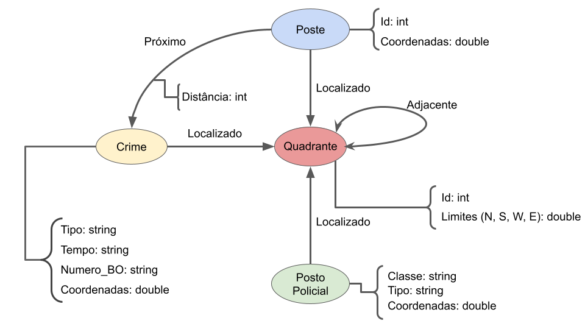

# Lab08 - Modelo Lógico e Análise de Dados em Grafos

Estrutura de pastas:

~~~
├── README.md  <- arquivo apresentando a tarefa
│
└── images     <- arquivos de imagem usados na tarefa
~~~

# Equipe `Os Delegados` - `SSPD`
* Antonio Gabriel da Silva Fernandes - 231551
* Bruno Henrique Emidio Leite - 214017
* Lucas de Paula Soares - 201867

## Modelo Lógico Combinado do Banco de Dados de Grafos

Para as nossas perguntas/análises, decidimos modificar os modelos propostos por cada um de nós para o laboratório 07 de forma a melhor adaptar o modelo aos tipos de análises apresentados para este trabalho. Dessa forma a informação relacionada ao local de postes, postos policiais e crimes agora foi encapsulada pelo nó `quadrante`, que representa um quadrado abrangendo um certo intervalo de coordenadas, em vez de um nó `local`, que representava apenas um par de coordenadas. Assim, podemos fazer análises mais significativas em relação a locais e distâncias.

## Perguntas de Pesquisa/Análise Combinadas e Respectivas Análises

### Pergunta/Análise 1
> Quais quadrantes são mais perigosos? 

* Será feita a análise de proximidade do quadrante com relação a crimes, ou seja, para cada quadrante será calculada a distância mínima dele para todos os nós de crime. Será aplicada a fórmula de *closeness centrality* para todos os nós de quadrante de forma que os que possuem uma centralidade maior são mais perigosos.

### Pergunta/Análise 2
> Qual a relação entre o grau de iluminação de um  quadrante e a quantidade de crimes que ocorrem dentro dele?

 * Será feita a análise de centralidade de grau (*degree centrality*) para os quadrantes tanto com relação aos nós de postes quanto com relação aos nós de crime. Será feita a comparação entre esses dois valores para cada um dos quadrantes, de forma a tentar detectar um relação entre esses índices.

### Pergunta/Análise 3
> Qual a relação entre a quantidade de crimes e a distância para postos policiais?

* Será feita a análise de centralidade de grau dos quadrantes em relação aos nós de crimes. Será feita a análise da centralidade de proximidade (*closeness centrality*) dos quadrantes com relação aos postos policiais. Será feita a comparação desses índices, de forma a tentar detectar uma possível relação.
